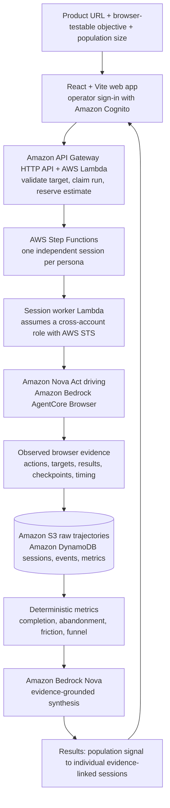

# Centopus

<p align='center'>
  
</p>

<h3 align='center'>Autonomous synthetic-user testing with independent AI browser agents</h3>

Centopus takes a product URL and a browser-testable objective, generates a population of distinct synthetic users, and gives each one its own real browser session. It records what those sessions actually did, computes results from that evidence, and uses AI to explain the evidence - never to invent it.

<p align='center'>
  <a href='https://github.com/SaiKrishna181707/centopus/actions/workflows/ci.yml'></a>
  <a href='LICENSE'></a>
</p>

Built for [First Commit - Bharat Builds Tour](https://www.wemakedevs.org/aws/first-commit) (WeMakeDevs x AWS Builder Center).

---

## Demo

[](https://youtu.be/OIuQfNFQq1U)

**[Watch the 3-minute demo](https://youtu.be/OIuQfNFQq1U)** - product URL -> synthetic population -> Nova Act browser journeys -> evidence-backed results.

The recording is a narrated product tour. Per the [demo script](docs/JUDGE_READY_3_MINUTE_DEMO_SCRIPT.md), its result screen uses a deterministic fixture so the presentation is repeatable; production runs use the live Nova Act path described below.

A deployment is built and published from `main` by GitHub Actions:

- **Web app:** https://main.d1s2dm4wj8xxb.amplifyapp.com
- **API health:** https://fkvvrndb17.execute-api.us-east-1.amazonaws.com/health reports `status: ok`, `mode: AWS`, `execution_available: true`, `live_view_available: false`, and a `release_sha` matching the current `main` commit.

Starting a real run requires operator sign-in and an authorized target. See [Verification status](#verification-status) for what is confirmed and what is not.

---

## What is Centopus?

Centopus automates repetitive browser-testing work using independent AI agents that actually interact with a product. You give it three things:

1. **A product URL** you own or are authorized to test.
2. **An objective** a person could attempt in the browser - for example, 'create a project and invite a teammate'.
3. **A population size** (1-100), optionally with the DOM checkpoints that define task completion.

You can start from the product's public site: Centopus reads a few public pages and uses Amazon Bedrock Nova to extract product facts and suggest objectives. It then generates a synthetic population whose members differ in technical confidence, product familiarity, patience, reading style, device class, motivations and abandonment triggers.

Each persona runs in its own persisted browser session, so a confident user, a scanning user and an impatient user can take genuinely different paths through the same flow. The result is a set of evidence-backed journeys with deterministic metrics - the bridge from a population-level signal to the individual session that produced it.

Centopus does not replace QA engineers or real user research. It automates repetitive execution and validation while human judgment stays in the loop.

## The Problem

Testing the same flow with many different kinds of users is repetitive and slow. Every iteration can mean recruiting participants, scheduling sessions, running them, collecting feedback and analysing it - before the next build starts the cycle again. Teams often ship on a handful of opinions, or postpone the test until a real cohort is available.

Existing tools answer different questions. QA answers *'does it work?'*, analytics answers *'where did users drop off?'*, and human research answers *'why did this person struggle?'*. Centopus adds a cheaper, repeatable layer before those: **what happens when many different kinds of users actually try this flow?** - so real research time goes to the questions that genuinely need people.

## How It Works

```text
product URL + objective
        |
        v
synthetic population of distinct personas
        |
        v
one independent browser session per persona   (AWS Step Functions, bounded concurrency)
        |
        v
Nova Act operates the real rendered page through AgentCore Browser
        |
        v
observed browser evidence: actions, targets, results, checkpoints, timing, stop reasons
        |
        v
raw trajectory in Amazon S3 + BehaviorEvent[] in Amazon DynamoDB
        |
        v
deterministic metrics computed from recorded events
        |
        v
evidence-grounded synthesis (presentation only)
        |
        v
results: population signal -> individual, evidence-linked sessions
```

Three layers stay deliberately separate:

- **Observed browser evidence** - what a session actually did, recorded from the browser: action, target, result, timestamp, URL, checkpoint and stop reason. Nothing else can determine an outcome.
- **Deterministic analytics** - completion, abandonment, timeout and technical-failure rates, funnel steps, retries, friction signals and time-to-value, all computed in code from recorded events. An empty denominator is reported as `n/a`, never as `0%`.
- **AI interpretation** - Amazon Bedrock Nova structures public product facts, writes persona narratives and refines report prose. It never changes a recorded outcome, metric or checkpoint, and a model statement is never accepted as proof that a task succeeded. If Nova refinement is unavailable, the evidence-only report is still complete.

## Why Centopus?

- **Independent journeys, not one scripted path.** Every persona gets its own persisted session, and concurrency is bounded by Step Functions. One agent's success is never copied across the population.
- **The browser is the source of truth.** Outcomes are computed from recorded browser events rather than model prose, and completion requires an explicitly observed DOM checkpoint.
- **Failure stays visible.** Retries, dead ends, abandonment, timeouts and technical failures are recorded and reported - not rewritten into success.
- **AI explains the evidence.** Nova's role is product understanding, persona language and evidence-grounded synthesis; the evidence and the numbers derived from it stay authoritative.

## Architecture



The control plane (API, orchestration, DynamoDB, S3) and the agent plane (the Nova Act worker and AgentCore Browser) are configured as two separate AWS accounts, connected by an IAM role restricted by principal ARN and an external ID. CloudWatch alarms, an EventBridge reconciliation rule, an SNS topic and an AWS Budget provide monitoring and spend notifications.

This diagram describes the implemented design and is not itself a deployment claim; see [Verification status](#verification-status).

## Tech Stack

| Area | Technology |
| --- | --- |
| Frontend | React 19, TypeScript, Vite |
| Hosting | AWS Amplify (`amplify.yml`) |
| API | Amazon API Gateway HTTP API, AWS Lambda (Node.js 22) |
| Orchestration | AWS Step Functions |
| Browser agents | Amazon Nova Act, Amazon Bedrock AgentCore Browser |
| AI | Amazon Bedrock (Nova Micro and Nova Lite via the Converse API) |
| Storage | Amazon DynamoDB, Amazon S3 |
| Authentication | Amazon Cognito Hosted UI (authorization code + PKCE, JWT authorizer) |
| Cross-account access | AWS IAM and AWS STS `AssumeRole` with an external ID |
| Infrastructure as code | AWS CDK (TypeScript) |
| Operations | Amazon CloudWatch, Amazon EventBridge, Amazon SNS, AWS Budgets |
| CI/CD | GitHub Actions (AWS OIDC roles, no long-lived keys) |
| Testing | Node's test runner via `tsx`, Playwright (`playwright-core`), Python `unittest` |

## Project Structure

```text
centopus/
|-- apps/
|   `-- web/                 React + Vite operator UI
|-- services/
|   |-- api/                 HTTP API Lambda: runs, personas, reports
|   |-- agent-worker/        Session worker Lambda + local L1 browser adapter
|   |-- nova-worker/         Python Nova Act / AgentCore Browser worker
|   |-- analytics/           Deterministic metrics from recorded events
|   |-- population/          Seeded synthetic persona generation
|   `-- report/              Evidence-linked report builder + Nova refiner
|-- packages/
|   |-- contracts/           Shared types, guardrails and validation
|   |-- ai/                  Amazon Bedrock Nova JSON boundary
|   `-- ui/                  Shared React UI primitives
|-- infra/
|   |-- cdk/                 AWS CDK stacks for both accounts
|   `-- policies/            Deployment role policies
|-- tests/                   unit / integration / browser / fixtures
|-- demo-target/             Local authorized practice target (Fieldwork)
|-- scripts/                 Bundle, deploy and verification helpers
`-- docs/                    Architecture, execution, cost and verification docs
```

## Quick Start

Requirements: Node.js **22.12+** (CI uses Node 22), npm, and Python **3.12** for the Nova worker checks. The local browser adapter and browser tests need an installed Chromium-based browser (Chrome or Edge).

```bash
git clone https://github.com/SaiKrishna181707/centopus.git
cd centopus
npm ci
npm run dev
```

The web app runs at http://127.0.0.1:5173.

### Try it locally without AWS

```bash
npm run dev:demo   # serves the authorized practice target (Fieldwork) on http://127.0.0.1:4174
npm run l1:run     # one synthetic user against it, in a real local browser
```

`npm run l1:run` uses a local heuristic policy, not Nova Act or AgentCore, and incurs no cloud cost. It writes its evidence to the git-ignored `.artifacts/` directory; see [the L1 notes](docs/l1-local-session.md).

### Quality gate

```bash
npm run check      # ESLint, all unit/integration tests, typecheck and production build
```

## Configuration

Centopus never requires a committed secret. Amazon Bedrock access is IAM-scoped, and public browser settings are the only frontend configuration.

| File | Purpose |
| --- | --- |
| `.env.example` (root) | Deployment settings for CDK and the AWS runtimes: region, control/agent account IDs, Amplify origin, cross-account external ID, optional existing table/bucket names, Bedrock model IDs and runtime ARNs. Export these into your shell - CDK does not read `.env` automatically. |
| `apps/web/.env.example` | Copy to `apps/web/.env` for local UI runs: `VITE_API_BASE_URL`, `VITE_AUTHORIZED_DOMAINS`, and the Cognito domain, client ID and redirect URI used for operator sign-in. |

`VITE_*` values are public and end up in the browser bundle - never put credentials or secrets there. If `VITE_API_BASE_URL` is unset, the web app falls back to the deployed API base URL compiled into `apps/web/src/lib/api.ts`.

Run `npm run infra:diff` before any deployment to review changes, and see [infra/README.md](infra/README.md) for the full prerequisite list.

## Testing

```bash
npm run check         # ESLint + unit/integration tests + typecheck + production build
npm run test:browser  # Playwright end-to-end flow through the UI
npm run test:python   # Python contract tests for the Nova worker
npm run nova:validate # validates the example Nova plan without AWS execution
npm run infra:synth   # CDK synthesis with offline fixture accounts, no deployment
```

The Node tests use mocked AWS clients, and the Python contract tests and plan validation need no cloud credentials. The suite focuses on the guardrails and evidence contracts: run admission and budget reservations, configuration validation, trace adaptation, metric computation, report assembly and failure handling.

CI runs the same commands on Node 22 and Python 3.12 - see [`.github/workflows/ci.yml`](.github/workflows/ci.yml).

## Deployment

- **Infrastructure:** AWS CDK defines two stacks (`<prefix>-control` and `<prefix>-agent`). Use `npm run infra:synth` (offline fixtures, no AWS), `npm run infra:diff` (compare against configured accounts) and `npm run infra:deploy`.
- **Application:** on every push to `main`, GitHub Actions builds the Lambda bundles and deploys them, and builds and publishes the Amplify-hosted frontend, authenticating with AWS OIDC roles.
- **Prerequisites:** account bootstrapping, cross-account trust and Docker are not configured for you. Follow [infra/README.md](infra/README.md) and the [submission checklist](docs/submission-checklist.md) before treating a deployment as production-ready.

## Verification Status

| Area | Status in this repository |
| --- | --- |
| Execution path | Implemented: API -> Step Functions -> session worker -> cross-account IAM/STS role -> Python Nova worker -> Nova Act on AgentCore Browser. |
| Evidence recording | Implemented: raw trajectories to S3 (`nova-trajectories/<session>.json`), `BehaviorEvent[]` to DynamoDB, reports to S3. |
| Completion proof | Requires an explicitly observed DOM checkpoint (`data-synthetic-checkpoint`). Uninstrumented sites still produce action and friction evidence, but completion stays unverified, and a model response is never accepted as proof. |
| Metrics and report | Deterministic metrics and an evidence-linked report computed from recorded events. Nova refinement is presentation-only and falls back to the evidence-only report. |
| Live View | Not integrated: the deployed API reports `live_view_available: false`. The UI polls session status and shows action evidence as sessions finish. |
| Actual billing | Not connected: `actual_cost_cents` stays `null`. Run admission uses estimate reservations, not measured spend. |
| Scale limits | Configured bounds: 100 users per run, 5 concurrent workers, 40 actions and 300 seconds per session, with estimate-based run admission against an $80 cumulative reservation ceiling and a configurable per-run cap (up to $80). See the [cost model](docs/cost-model.md). These are configured limits, not verified load-test results. |
| Live end-to-end run | Not asserted here: Cognito sign-in, cross-account trust, AgentCore/Nova quotas and an end-to-end AWS session still need the manual checks in the [submission checklist](docs/submission-checklist.md). |

[docs/final-deployment-report.md](docs/final-deployment-report.md) records the last local verification snapshot; [infra/README.md](infra/README.md) documents the infrastructure verification boundary.

## Responsible Use

- Test only products you own or are explicitly authorized to test.
- Synthetic users are simulations. They do not measure demand, emotion, cultural context or purchasing intent, and they are not a substitute for real user research.
- Keep human judgment in the loop: use Centopus to find candidate friction cheaply, then confirm what matters with real people.

## Documentation

| Document | Contents |
| --- | --- |
| [docs/README.md](docs/README.md) | Index of all documentation |
| [docs/architecture.md](docs/architecture.md) | System boundaries, storage contract, states and interruptions |
| [docs/aws-execution.md](docs/aws-execution.md) | Nova Act / AgentCore execution, evidence rules and required AWS checks |
| [docs/cost-model.md](docs/cost-model.md) | Estimate inputs, spend guardrails and budget enforcement |
| [docs/final-deployment-report.md](docs/final-deployment-report.md) | Recorded local verification and remaining warnings |
| [docs/submission-checklist.md](docs/submission-checklist.md) | Live checks still outstanding |
| [infra/README.md](infra/README.md) | CDK scope, deployment configuration and prerequisites |
| [services/nova-worker/README.md](services/nova-worker/README.md) | Python worker setup, SDK verification and container notes |
| [docs/l1-local-session.md](docs/l1-local-session.md) | The local, non-AWS session adapter in detail |
| [demo-target/README.md](demo-target/README.md) | The authorized practice target and its deliberate friction |

## License

[MIT](LICENSE) (c) 2026 Sai Krishna Chowdary
