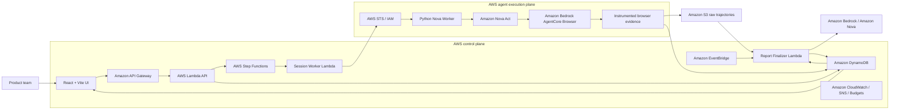

# Centopus

<p align="center">
  
</p>

<h3 align="center">Automated beta testing with up to 100 independent browser agents.</h3>

<p align="center">
  <strong>Centopus turns AI from a reviewer into a participant.</strong><br/>
  Give it a product URL and a task. Centopus creates a population of distinct synthetic users, gives each session its own browser journey, records what actually happened, and turns that evidence into product feedback.
</p>

<p align="center">
  Built for <a href="https://www.wemakedevs.org/aws/first-commit">First Commit — Bharat Builds Tour</a> by WeMakeDevs × AWS Builder Center.
</p>

---

## 🎬 3-minute demo

<p align="center">
  <a href="https://youtu.be/OIuQfNFQq1U">
    
  </a>
</p>

<p align="center">
  <strong><a href="https://youtu.be/OIuQfNFQq1U">▶ Watch Centopus in action</a></strong><br/>
  Product URL → synthetic population → Nova Act browser journeys → evidence-backed results.
</p>

---

## The problem

Beta testing is valuable, but it is difficult to repeat at product-development speed.

Every new feature can mean recruiting people, coordinating schedules, explaining tasks, waiting for sessions, collecting feedback, analysing it, and then repeating the cycle after the next build.

Traditional QA answers **“does it work?”**  
Analytics answers **“where did users drop?”**  
Human research answers **“why did this person struggle?”**

Centopus adds a missing layer before those expensive human cycles:

**What happens when many different kinds of users actually try the product?**

Instead of assembling a fresh beta group for every early iteration, a team can launch synthetic users on demand, find likely friction, and reserve real human research for the questions that genuinely need human judgment.

> **Automate the repetition. Keep the human insight.**

---

## What Centopus does

Centopus takes three inputs:

1. **Product URL**
2. **A browser-testable customer task**
3. **Population size**

It then creates distinct personas with different technical confidence, product familiarity, patience, reading style, device class, motivations, sensitivities, and abandonment triggers.

Each persona maps to its **own persisted browser session**.

A confident user may immediately find the right path.  
A scanning user may miss a control.  
Another may retry, backtrack, get stuck, or stop.

Those differences are the test.

> **Centopus does not ask an LLM to imagine 100 reviews.**  
> It sends synthetic users through actual browser-agent execution and records the journeys.

Amazon Nova Act operates the rendered website through Amazon Bedrock AgentCore Browser. The agent can click, scroll, type, navigate, wait, retry, recover, or stop according to what it sees and the persona it is representing.

The final result is a population of **evidence-backed journeys**, not a pile of hypothetical opinions.

---

## Why Centopus is different

### 1. Every persona gets an independent journey

One successful browser flow is not copied across the population. Each session is persisted and executed independently, with AWS Step Functions controlling concurrency.

### 2. The browser is the source of truth

The model cannot simply say, “I completed the task.”

Centopus records browser-observed actions, states, checkpoints, timing, failures, and stop reasons. Outcomes are calculated from those events.

### 3. Failure is useful data

Retries, dead ends, abandonment, timeouts, and confusion stay visible. They are not rewritten into success.

### 4. Nova explains the evidence — it does not replace it

Amazon Nova helps with product understanding, persona language, and final feedback synthesis. The underlying session outcome remains tied to recorded browser evidence.

**Evidence before opinion.**

---

## AWS architecture

AWS is not just where Centopus is hosted. It is the execution engine.

The diagram below is rendered directly by GitHub.



### AWS services in the product

| Layer | AWS services | Role in Centopus |
|---|---|---|
| Browser agents | **Amazon Nova Act + Amazon Bedrock AgentCore Browser** | Let each synthetic user observe and act on the rendered website |
| AI | **Amazon Bedrock + Amazon Nova Micro/Lite** | Product understanding, persona language, evidence-grounded synthesis |
| Orchestration | **AWS Step Functions + AWS Lambda** | Execute independent sessions with bounded concurrency |
| Evidence | **Amazon DynamoDB + Amazon S3** | Persist session state, events, raw trajectories, and reports |
| API | **Amazon API Gateway** | Connect the web app to the execution control plane |
| Security | **AWS IAM + AWS STS** | Least-privilege and cross-account execution |
| Operations | **CloudWatch + EventBridge + SNS + AWS Budgets** | Monitoring, reconciliation, alerts, and spend guardrails |
| Infrastructure | **AWS CDK** | Reproducible infrastructure as code |
| Frontend | **AWS Amplify configuration** | Build and hosting path for the React application |

### Deliberate scale and cost controls

A configured run is bounded to:

- **100 users per run**
- **5 concurrent session workers**
- **40 browser actions per session**
- **300 seconds maximum per browser session**
- estimate-based run admission plus AWS Budget/SNS guardrails

The goal is controlled population-scale testing, not uncontrolled browser fan-out.

For the detailed model, see [docs/cost-model.md](docs/cost-model.md).

---

## How a run becomes a product decision

```text
Product URL + objective
        ↓
Amazon Nova product understanding
        ↓
Distinct synthetic population
        ↓
Step Functions session orchestration
        ↓
Nova Act + AgentCore Browser
        ↓
Observed browser actions and checkpoints
        ↓
S3 raw trajectory + DynamoDB events
        ↓
Deterministic metrics
        ↓
Nova evidence-grounded synthesis
        ↓
Population result + individual feedback
```

A product team can start with the aggregate result, identify repeated friction, filter problematic experiences, and then open the individual journey behind the finding.

Centopus can surface:

- completion and abandonment,
- repeated friction patterns,
- retries and navigation failures,
- time-to-value,
- positive / mixed / negative outcomes,
- individual evidence-linked feedback,
- cohort and funnel signals,
- and a prioritized product recommendation.

That bridge from **population signal → individual evidence** is the core product.

---

## What we learned building it

The hardest part was not making an agent click a website. It was making browser-agent behavior trustworthy enough to use as product evidence.

Three lessons shaped the architecture:

**Model output is not evidence.**  
We built an instrumented browser boundary so the measured outcome comes from observed actions and states rather than the agent's final prose.

**Agent scale needs operational boundaries.**  
Independent sessions require concurrency limits, spend controls, idempotency, cancellation/reconciliation logic, and careful retry behavior because browser actions have real side effects.

**AI and analytics should have different jobs.**  
Deterministic code computes the outcome. Nova improves product context and the language of the final explanation without changing the recorded result.

---

## Real-world use

Centopus is designed for product managers, UX teams, designers, founders, QA teams, and engineers who need to test more often than they can recruit.

It can help teams:

- pressure-test a new flow before beta users see it,
- repeat the same usability objective after product changes,
- explore behavior across different user profiles,
- find journeys that deserve deeper human research,
- and give real testers a better product to start with.

Centopus does **not** replace the things only real people can provide: genuine emotion, trust, cultural context, lived experience, desirability, and purchasing intent.

It automates the repetitive early validation around those people.

---

## Run locally

### Requirements

- Node.js **22.12+**
- npm
- Python **3.12**
- AWS credentials/configuration for the cloud execution path

### Install, test, and build

```bash
npm ci
npm run check
npm run infra:synth
npm run test:python
npm run nova:validate
```

### Start the web app

```bash
npm run dev
```

For the full AWS deployment path and required environment values, see [infra/README.md](infra/README.md).

The Nova worker's direct Python runtime dependencies are pinned in `services/nova-worker/requirements.txt`.

---

## Team

### Sai Krishna — Project Lead & Product / Architecture Lead

Led the product vision, system architecture, UX direction, feature planning, integration, testing, and final delivery. Worked across the population flow, Nova-powered intelligence, reporting experience, frontend, AWS architecture, and end-to-end product integration.

### Vivek — Technical Co-Lead & AWS / Agent Systems Lead

Worked across the same core product with a strong focus on Nova Act, Amazon Bedrock, AgentCore Browser, cross-account AWS execution, Lambda/session infrastructure, browser evidence, reliability, debugging, and integration between the agent runtime and the product.

Both leads collaborated across architecture, implementation, testing, debugging, and final integration.

---

## Technical documentation

For judges or engineers who want to inspect the implementation deeper:

- [Architecture and storage contract](docs/architecture.md)
- [AWS execution and evidence model](docs/aws-execution.md)
- [Cost model and guardrails](docs/cost-model.md)

Other audit, local-development, and submission-preparation files are indexed in [docs/README.md](docs/README.md) and are supporting material rather than required reading.

---

## Responsible use

Centopus is intended for web products you own or are authorized to test.

Synthetic users are simulated agents, not real customers. The browser worker is bounded by target validation, host restrictions, time/action ceilings, and protections around destructive, credential, CAPTCHA, and real-payment interactions.

---

<p align="center">
  <strong>Centopus</strong><br/>
  Don't ask AI what a user might do.<br/>
  <strong>Give the user a browser and find out.</strong>
</p>
