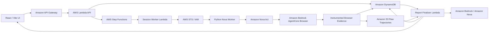

# Centopus

<p align="center">
  
</p>

<h3 align="center">Automated beta testing with up to 100 independent browser agents.</h3>

<p align="center">
  <strong>Centopus turns AI from a reviewer into a participant.</strong><br/>
  Instead of recruiting people for every early test cycle, teams can launch a population of synthetic users that open the product, see the interface, make decisions, take actions, get stuck, recover, and sometimes abandon the task — then bring real users in where human judgment matters most.
</p>

<p align="center">
  Built for <a href="https://www.wemakedevs.org/aws/first-commit">First Commit — Bharat Builds Tour</a> by WeMakeDevs in collaboration with AWS Builder Center.
</p>

## 🎬 3-Minute Demo

<p align="center">
  <a href="https://youtu.be/OIuQfNFQq1U">
    
  </a>
</p>

<p align="center">
  <strong><a href="https://youtu.be/OIuQfNFQq1U">▶ Watch Centopus in action</a></strong><br/>
  From product URL → synthetic population → independent Nova Act browser journeys → evidence-backed results.
</p>

---

## The problem

Beta testing is valuable — but it is also slow, repetitive, and expensive to run every time a product changes.

Teams have to recruit the right people, coordinate schedules, explain the task, wait for sessions, collect feedback, clean the results, and then repeat the whole process after the next build. Small teams often cannot do this for every feature, every flow, every device profile, or every release candidate.

Traditional QA answers **"does it work?"**  
Analytics answers **"where did users drop?"**  
Human research answers **"why did this person struggle?"**

But there is a large gap before all of that: **what happens when many different kinds of users actually try the product?**

Centopus automates that early testing layer.

Instead of needing a fresh group of beta users for every iteration, a team can launch dozens of distinct synthetic users on demand, let them actually operate the product, and identify likely friction before spending human research time on it.

The goal is not to remove people from product research. It is to make human testing **more focused, less repetitive, and more valuable**.

## What Centopus does

Give Centopus:

1. a product URL,
2. a task you want a user to complete,
3. and the size of the synthetic population.

Centopus builds a population of distinct personas and gives **each session its own browser journey**.

A patient power user may immediately find the right path.  
A scanning user may miss an important control.  
A less technical user may retry, backtrack, or get stuck.  
Another persona may decide the task is not worth continuing.

Those differences become the test.

> **Centopus does not ask an LLM to imagine 100 reviews.**  
> It can create up to 100 synthetic users and send their sessions through real browser-agent execution.

Every session is handled independently. Amazon Nova Act observes the rendered product through Amazon Bedrock AgentCore Browser, decides what to do next, and performs browser actions such as clicking, scrolling, typing, navigating, waiting, retrying, or stopping.

The result is not a pile of generated opinions. It is a population of **evidence-backed journeys**.

---

## Why this is different

### Most AI feedback is hypothetical. Centopus is behavioral.

The agent does not receive a screenshot and write a pretend review. It interacts with the actual website.

### Every persona gets its own journey.

Centopus maps each persona to a separate persisted session. Sessions are orchestrated in controlled parallel batches so one user's path does not become everybody's path.

### Evidence decides the outcome.

The agent's final sentence does **not** decide whether a task succeeded.

Centopus records browser-observed actions and checkpoints. Completion, abandonment, retries, friction, and timing are calculated from those events.

### Nova can improve the explanation — not rewrite reality.

Amazon Nova is used after the evidence is collected to turn raw results into useful, readable feedback. The underlying outcome remains tied to the recorded browser journey.

**Evidence before opinion.**

---

## How one Centopus run works

```text
Product URL + usability objective
              |
              v
     Amazon Nova product intelligence
              |
              v
   Distinct synthetic population
       (up to 100 personas)
              |
              v
       AWS Step Functions
    controlled session orchestration
              |
              v
     One persisted session/persona
              |
              v
 Amazon Nova Act + AgentCore Browser
   observe -> reason -> act -> react
              |
              v
      Browser evidence recorder
 clicks / typing / scrolls / navigation
 checkpoints / errors / stop reasons
              |
              v
     S3 raw trajectory + DynamoDB
              |
              v
       Deterministic analytics
              |
              v
 Amazon Nova evidence-grounded synthesis
              |
              v
    Population results + agent feedback
```

### 1. Understand the product

Centopus safely reads a small set of first-party public pages and uses Amazon Nova through Amazon Bedrock to extract product context and suggest observable usability objectives.

### 2. Build the population

Centopus creates editable personas that vary across attributes such as:

- technical ability,
- product familiarity,
- patience,
- reading style,
- device class,
- motivations,
- price and privacy sensitivity,
- decision style,
- and abandonment triggers.

The goal is not demographic prediction. The goal is to create meaningfully different ways of approaching the same task.

### 3. Give every persona a browser journey

For each session, the worker starts an Amazon Bedrock AgentCore Browser session and runs Amazon Nova Act against the rendered website.

Nova Act is prompted to behave as that synthetic user — not as a QA engineer trying to make the test pass.

It can misunderstand the UI, scan past something, retry, backtrack, or abandon.

### 4. Record what actually happened

Centopus wraps browser actions with an evidence recorder.

It captures the page state and action trail, including:

- URL and page title,
- visible DOM checkpoints,
- click/type/scroll/navigation actions,
- action targets,
- success, error, or no-change results,
- timestamps and elapsed time,
- console/network errors,
- and stop/reason codes.

### 5. Calculate results from evidence

Completion and friction metrics are derived from recorded session events — not from model self-report.

The report can show completion, abandonment, time-to-value, retries, friction signals, funnels, cohort results, and individual agent outcomes.

### 6. Turn evidence into product feedback

Only after the result is known does Amazon Nova help refine the language.

That gives product teams readable positive, mixed, and negative feedback while preserving the browser evidence underneath it.

---

## AWS architecture

Centopus is not simply hosted on AWS. AWS is the execution engine of the product.



### AWS services used

| Layer | AWS services | What they do in Centopus |
|---|---|---|
| Browser agents | **Amazon Nova Act + Amazon Bedrock AgentCore Browser** | Let each synthetic user observe and act on the rendered website |
| Intelligence | **Amazon Bedrock + Amazon Nova Micro/Lite** | Product understanding, persona language, and evidence-grounded feedback synthesis |
| Orchestration | **AWS Step Functions + AWS Lambda** | Turn a population into bounded, independently executed browser sessions |
| State & evidence | **Amazon DynamoDB + Amazon S3** | Store session state, BehaviorEvents, raw trajectories, and reports |
| API | **Amazon API Gateway** | Connect the web application to the execution control plane |
| Security | **AWS IAM + AWS STS** | Least-privilege and cross-account agent execution |
| Operations | **Amazon CloudWatch + EventBridge + SNS + AWS Budgets** | Errors, reconciliation, alerts, and spend guardrails |
| Infrastructure | **AWS CDK** | Reproducible infrastructure as code |
| Frontend delivery | **AWS Amplify configuration** | Build/hosting path for the React application |

---

## The engineering challenge

Making an AI agent click a website is the easy part.

Making a population of browser agents **bounded, auditable, reproducible, and safe enough to trust as product evidence** is the harder problem Centopus tackles.

### Independent sessions

A terminal or duplicate delivery cannot silently open another browser for the same completed session. Browser side-effect retries are deliberately constrained because a retry could duplicate actions and spend.

### Bounded execution

A configured run supports:

- up to **100 users**,
- up to **5 concurrent session workers**,
- up to **40 browser actions per session**,
- and up to **300 seconds per browser session**.

The population can therefore be large without pretending that 100 browsers need to execute simultaneously.

### Browser guardrails

Execution is constrained in code, not only by prompts.

Centopus includes:

- authorized HTTPS target validation,
- exact-host navigation controls,
- session time limits,
- action limits,
- protection around destructive/payment-sensitive interactions,
- and explicit stop conditions.

### Failure is data too

A missing checkpoint does not become a success because the model says it is done.

If the agent gets stuck, times out, encounters an error, or abandons, that result remains visible to the reporting layer.

---

## What a product team gets

At the end of a run, Centopus turns many individual journeys into something a team can act on:

- population-level positive / mixed / negative outcomes,
- completion and abandonment,
- repeated friction patterns,
- retries and navigation failures,
- evidence-linked individual feedback,
- funnel and cohort analysis,
- and a prioritized product recommendation.

A PM can start from the aggregate result, filter the problematic experiences, then drill down into the individual journey that produced the finding.

That bridge from **population signal -> individual evidence** is the point of Centopus.

---

## Why it matters

Centopus is designed to remove the repetitive pain around beta testing without removing the humans who make product research valuable.

Today, every new flow can mean another round of recruitment, scheduling, coordination, observation, note-taking, analysis, and retesting. That makes broad user testing difficult to repeat at product-development speed.

Centopus makes that layer available on demand.

A product team can use it to:

- test a new flow before inviting beta users,
- explore many user behaviors without recruiting a new cohort,
- repeat the same task after every important product change,
- expose edge cases across patience, familiarity, reading style, and technical confidence,
- identify the journeys that deserve deeper human research,
- and give real testers a better product to start with.

This changes where human effort is spent.

Instead of asking people to repeatedly discover obvious navigation friction, broken expectations, confusing controls, or dead ends, Centopus can surface those issues earlier. Human testers can then spend their time on the things synthetic agents cannot truly provide: emotion, trust, taste, cultural context, lived experience, desirability, and genuine purchasing intent.

Centopus is therefore not a replacement for beta users or UX researchers.

It is **automation around them** — reducing how often teams need humans for repetitive early validation and making every real human testing session more valuable.

**Automate the repetition. Keep the human insight.**

---

## Built for First Commit — Bharat Builds Tour

Centopus was built for the **First Commit** stop of the WeMakeDevs **Bharat Builds Tour**, in collaboration with AWS Builder Center.

The project is intentionally aligned with what the event asks teams to demonstrate:

| Judging area | Centopus |
|---|---|
| **Idea & Impact** | Finds product usability friction before customers have to discover it |
| **Built on AWS** | Nova Act, AgentCore Browser, Bedrock, Step Functions, Lambda, DynamoDB, S3, API Gateway, IAM/STS, CloudWatch, EventBridge, SNS, Budgets, CDK and Amplify configuration |
| **Learning** | Required us to solve browser evidence capture, cross-account execution, bounded agent orchestration, failure reconciliation, and trustworthy AI reporting |
| **Execution** | End-to-end application path from product input -> personas -> browser agents -> recorded evidence -> deterministic metrics -> report |
| **Demo** | Designed around one visible story: create the test, build the population, launch the agents, then inspect the evidence behind the result |

---

## Run the project

### Requirements

- Node.js **22.12+**
- npm
- Python **3.12**
- AWS credentials/configuration for the production AWS execution path

### Install and verify

```bash
npm ci
npm run check
npm run build
npm run infra:synth
npm run test:python
npm run nova:validate
```

For full Python SDK verification:

```bash
python -m venv .venv
# activate the environment for your shell
python -m pip install -r services/nova-worker/requirements.txt
python -m pip check
python services/nova-worker/verify_sdk.py
```

### Start the frontend

```bash
npm run dev
```

Copy `apps/web/.env.example` to `apps/web/.env` and configure the API/AWS outputs required by your environment.

### Local owned demo target

```bash
npm run dev:demo
```

The repository also contains a local heuristic browser adapter for development:

```bash
npm run l1:run
```

The local adapter is intentionally separate from the Nova Act + AgentCore Browser production execution path.

---

## Repository map

```text
centopus/
├── apps/web/                  # React + Vite product UI
├── services/api/              # HTTP API and product intelligence
├── services/agent-worker/     # Session orchestration + persistence
├── services/nova-worker/      # Nova Act + AgentCore Browser execution
├── services/population/       # Synthetic population generation
├── services/analytics/        # Deterministic event-derived metrics
├── services/report/           # Evidence-linked report generation
├── packages/                  # Shared contracts / AI helpers
├── infra/cdk/                 # AWS infrastructure as code
└── docs/                      # Architecture, execution and verification docs
```

---

## Team

### Sai Krishna — Project Lead & Product / Architecture Lead

Led the product vision, system architecture, UX direction, feature planning, integration, testing, and final delivery. Worked across the synthetic population flow, Nova-powered intelligence, reporting experience, frontend, AWS architecture, and end-to-end product integration.

### Vivek — Technical Co-Lead & AWS / Agent Systems Lead

Worked across the same core architecture and product development with a strong focus on the agent execution layer: Nova Act, Amazon Bedrock, AgentCore Browser, cross-account AWS execution, Lambda/session infrastructure, browser evidence, reliability, debugging, and integration between the agent runtime and the product.

Both leads collaborated across architecture, implementation, testing, debugging, and final integration rather than splitting the project into isolated pieces.

---

## Responsible use

Centopus is for web products you own or are authorized to test.

Synthetic users are simulated agents. They are useful for automating repetitive early-stage beta and usability testing, but they are **not real customers**. They do not measure genuine emotion, trust, cultural context, market demand, or purchasing intent. Centopus is designed to reduce unnecessary human testing cycles and help teams use real beta users where human insight matters most.

The browser worker is designed around bounded execution and avoids destructive actions, real-money purchases, credential harvesting, CAPTCHA bypass, or leaving the approved target.

---

## Documentation

- [Architecture and storage contract](docs/architecture.md)
- [AWS execution and evidence](docs/aws-execution.md)
- [Cost model](docs/cost-model.md)
- [Integration audit](docs/integration-audit.md)
- [Submission checklist](docs/submission-checklist.md)
- [Demo script](docs/demo-script.md)
- [Submission packet](docs/submission-packet.md)
- [Verification status](docs/final-deployment-report.md)

<details>
<summary><strong>Verification note</strong></summary>

Local tests, infrastructure synthesis, and source inspection are not substitutes for a fresh AWS execution record. Deployment, browser access, quotas, and actual AWS billing should be demonstrated with the run used in the submission. Configured limits are capabilities of the implementation, not a claim that every scale configuration has been independently load-tested.

</details>

---

<p align="center">
  <strong>Centopus</strong><br/>
  Don't ask AI what a user might do.<br/>
  <strong>Give the user a browser and find out.</strong>
</p>
