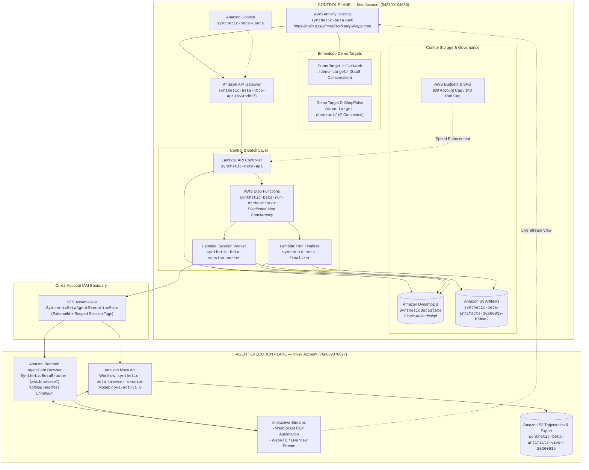

# Canonical Architecture

Synthetic Beta deploys autonomous synthetic users into isolated browser sessions against web products you are authorized to test. The core architectural differentiator is that agents operate the **real product in a real browser**, while numerical analytics remain deterministic functions of recorded evidence.

The production deployment uses a canonical **dual-account architecture** that physically isolates the client-facing control plane from the autonomous agent execution plane.

---

## Dual-Account Architecture Overview



---

## 1. Account Roles & Service Catalog

### A. Control Plane — Kittu Account (`643700104680`)

The Control Plane manages user identities, API admissions, run state machines, data persistence, deterministic analytics calculations, and report generation.

| Component | AWS Service | Resource Identifier / Details | Purpose |
| --- | --- | --- | --- |
| **Web Frontend** | AWS Amplify Hosting | `synthetic-beta-web` (`https://main.d1s2dm4wj8xxb.amplifyapp.com`) | Deploys Vite/React single-page application from `main` branch. Serves the operator console, live telemetry visualizer, session inspector, and final report viewer. |
| **Demo Target 1** | Amplify Static Hosting | Route: `/demo-target/` | **Fieldwork**: SaaS project collaboration application with realistic UX friction (discoverability traps, layout shifting, retry loops). |
| **Demo Target 2** | Amplify Static Hosting | Route: `/demo-target-checkout/` | **ShopPulse**: E-commerce catalog and multi-step checkout application testing cart interactions, promo code accordions, and form validation hurdles. |
| **HTTP API Gateway** | Amazon API Gateway | `synthetic-beta-http-api` (API ID: `fkvvrndb17`) | Provides HTTP endpoints for run configuration, run validation, real-time status polling, session events, metrics, and report downloads with CORS protection. |
| **Authentication** | Amazon Cognito | User Pool: `synthetic-beta-users` | Issues JWT tokens for administrative and authorized operator sessions. |
| **State Store** | Amazon DynamoDB | Table: `SyntheticBetaState` (Pay-per-request billing) | Single-table partition scheme (`RUN#<id>`, `SESSION#<id>`, `EVENT#<ts>`, `METRICS`, `FINDINGS`, `REPORT`) with 7-day automated TTL. |
| **Batch Orchestrator** | AWS Step Functions | State Machine: `synthetic-beta-run-orchestrator` | Coordinates 1 to 100 sessions using Distributed Map state, enforcing concurrency ceilings (batches of 10 to 20) and timeout limits. |
| **Control Lambdas** | AWS Lambda | `synthetic-beta-api`, `synthetic-beta-session-worker`, `synthetic-beta-finalizer` | Node.js 22 runtime handlers executing API dispatch, worker coordination, and post-run deterministic metrics reduction. |
| **Control S3 Storage** | Amazon S3 | Bucket: `synthetic-beta-artifacts-20260919-k7m4q2` | Stores structured `session.json`, `events.json`, checkpoint screenshots, and finalized JSON reports with presigned download URLs. |
| **Cost Governance** | AWS Budgets & SNS | Budget: `SyntheticBetaSpendLimit` | $80 hard account cap, $40 per-run hard limit, triggering SNS alerts and automated run admission rejection. |

### B. Agent Execution Plane — Vivek Account (`768669378827`)

The Agent Plane contains the secure, isolated compute sandbox where autonomous agents operate real browsers over remote protocols.

| Component | AWS Service | Resource Identifier / Details | Purpose |
| --- | --- | --- | --- |
| **Managed Browser Sandbox** | Amazon Bedrock AgentCore Browser | `SyntheticBetaBrowser` (Runtime ID: `aws.browser.v1`) | Ephemeral, sandboxed Chromium instances running in secure AWS micro-VMs with server-side timeouts (180s default, 300s max). |
| **Browser Streams** | Bedrock AgentCore Automation & Live View | WebSocket Automation Stream & WebRTC Live View | Exposes a CDP WebSocket endpoint for agent control and a secure WebRTC Live View URL rendered inside the operator frontend. |
| **Autonomous Agent Model** | Amazon Nova Act | Workflow: `synthetic-beta-browser-session`<br/>Model: `nova-act-v1.0` | Multimodal foundation model acting over browser DOM and screenshots. Interprets persona traits and goals to execute autonomous actions without canned scripts. |
| **Cross-Account Identity** | AWS IAM | Role: `SyntheticBetaAgentExecutionRole` | Cross-account IAM role assumed by the Control Plane worker Lambda to spin up browser instances and execute Nova Act workflows. |
| **Agent Trace Storage** | Amazon S3 | Bucket: `synthetic-beta-artifacts-vivek-20260919` | Raw Nova Act step trajectories, CDP event dumps, and browser frame logs before trace adaptation. |

---

## 2. Cross-Account Interaction & Execution Flow

```text
[Operator / Frontend]
        │  1. Submit Run (target URL, audience, objective, 100 users, $40 cap)
        ▼
[API Gateway: fkvvrndb17]
        │  2. Validate plan, origins, and budget admissions
        ▼
[Control Plane Lambda: synthetic-beta-api]
        │  3. Seed population, write RUN#<id> to DynamoDB: SyntheticBetaState
        ▼
[Step Functions: synthetic-beta-run-orchestrator]
        │  4. Distributed Map dispatches controlled batches (5 x 20)
        ▼
[Control Plane Lambda: synthetic-beta-session-worker]
        │  5. sts:AssumeRole -> arn:aws:iam::768669378827:role/SyntheticBetaAgentExecutionRole
        ▼
[Agent Plane: Bedrock AgentCore Browser (aws.browser.v1)]
        │  6. Initialize sandboxed Chromium session -> returns CDP WebSocket & Live View URL
        ▼
[Agent Plane: Amazon Nova Act (nova-act-v1.0)]
        │  7. Connect to CDP stream, evaluate DOM/screenshots, execute actions against target
        │  8. Write raw trajectory to S3: synthetic-beta-artifacts-vivek-20260919
        ▼
[Control Plane Worker Adapter: nova-trace-adapter.ts]
        │  9. Ingest raw Nova steps -> convert to strict BehaviorEvent[] (Zero Hallucinations)
        │  10. Write events & session metadata to DynamoDB & S3 Control Bucket
        ▼
[Control Plane Lambda: synthetic-beta-finalizer]
        │  11. Triggered on Map completion -> execute computeRunMetrics & buildSyntheticBetaReport
        │  12. Write final findings to DynamoDB & generate presigned S3 report artifact
        ▼
[Operator Frontend: apps/web]
        13. Renders live funnel metrics, drop-off friction points, and session replays
```

---

## 3. Data Schema & Separation of Concerns

### Deterministic Computation vs. Autonomous Agency

1. **Agent Space (Autonomous Reasoning)**:
   - Nova Act uses vision and language understanding to decide *where to click*, *what to type*, and *when to give up*.
   - The agent is conditioned with structured persona attributes (`technical_ability`, `product_familiarity`, `patience`, `reading_style`, `device_class`, `price_sensitivity`).
   - The agent never performs calculations or computes aggregated statistics.

2. **Trace Adapter Boundary (`nova-trace-adapter.ts`)**:
   - Converts raw Nova Act trajectory steps (`RawNovaStep[]`) into strictly typed `BehaviorEvent[]` records.
   - Preserves exact millisecond offsets, sanitized target URLs, element descriptors, HTTP/console errors, and normalized agent reason codes (`EXPLORING`, `GOAL_PROGRESS`, `RETRYING`, `CONFUSED`, `PATIENCE_EXHAUSTED`, `SAFETY_STOP`).
   - Rejects manufactured event rows; if Nova produces no event, none is created.

3. **Analytics Space (Pure Mathematics)**:
   - `computeRunMetrics` in `@synthetic-beta/analytics` is a pure function over immutable `SessionRecord` and `BehaviorEvent` collections.
   - Produces deterministic completion rates, funnel drop-offs, retry friction counts, time-to-value distributions, and cohort cross-tabs.
   - Every rate maintains explicit integer numerators and denominators (`supporting_session_ids`), ensuring full auditability.

---

## 4. Security & Isolation Posture

1. **Strict Target Whitelisting**:
   - Cloud execution only permits public HTTPS targets that exist in the pre-approved `allowed_origins` configuration.
   - Private IP ranges (`10.0.0.0/8`, `172.16.0.0/12`, `192.168.0.0/16`), loopbacks (`127.0.0.1`, `localhost`), link-local (`169.254.169.254`), and internal AWS service endpoints are rejected at API validation and by the runtime guardrail.

2. **Cross-Account Least Privilege**:
   - `SyntheticBetaAgentExecutionRole` in Account `768669378827` trusts only the specific execution role ARN of the Session Worker Lambda in Account `643700104680`.
   - Requires an `sts:ExternalId` matching the specific deployment environment.
   - Permissions are restricted strictly to `bedrock:StartBrowserSession`, `bedrock:StopBrowserSession`, `bedrock:GetBrowserSession`, `nova-act:*`, and scoped `s3:PutObject` on `synthetic-beta-artifacts-vivek-20260919/nova-trajectories/*`.

3. **Zero Destructive Actions**:
   - Prompt-level and guardrail-level constraints forbid real-money transactions, user account deletions, credential exposure, external spam, or CAPTCHA circumvention.
   - Secret redaction automatically strips embedded query parameters, passwords, and authorization tokens before writing events to DynamoDB or S3.

4. **Spend Ceilings**:
   - **$80 Global AWS Budget**: Tracks cumulative spend across both accounts with automated SNS alerts.
   - **$40 Per-Run Hard Cap**: Validated prior to dispatching Step Functions executions; runs exceeding estimated spend are aborted before any browser initializes.

